Examples
========

Poster design
#############
Goal
****
The goal for this exaple was to create posters. The training data was fetched from https://trendlist.org

Nodes
*****

Data Sorter
-----------
The Data sorter got the following instructions:
  You have been assigned to be a data sorter. You sort the data by splitting it down into training data for the creators. You then feeds the data to the creators and the evaluator. In this case we are going to be designing a poster with 4 creation nodes. A way to split the data (posters) into 4 parts would be to isolate the image content and color, typographic position, typefaces, and content.

  After each set your job is to gather the 4 results from the content creators and combining it with 4 existing posters to give to the evaluator. You also have to normalize the data, so make each poster 500px wide. When the data is normalized move it into a folder called Evaluation.

  You should also save the files into a folder called Tracking, where you indicate which ones are original(marked blue) and which ones are created by the creator nodes (marked green).

Creator Nodes
-------------
Creator 1
^^^^^^^^^
The Creator 1 got the following instructions:
  Your job is to analyze the training data and then create a poster based on the data. Your main goal is to trick the Evaluator into thinking your creation is authentic. You can copy the elements from the training data, but the Evaluator gets the same data so he can spot direct copies.

  You get the job of deciding the typographic position. Your job is to only position the text boxes and the text sizes. You do NOT decide the content, colors or typefaces

  Each set you work on 1 file for 30 seconds
  (1 round) at the time.
  You work on file 1 - 2 - 3 - 4 in that order.
  Between rounds there is a break. You should use that to save your file and open the next one. After the 4th round please save the file you are working on also as a pdf in the folder evaluation.

Training Data:

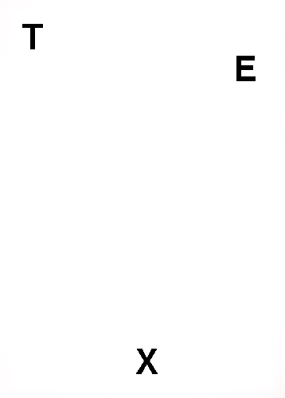
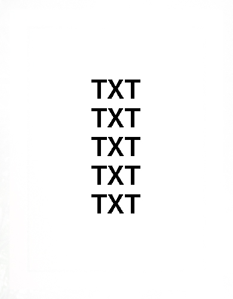
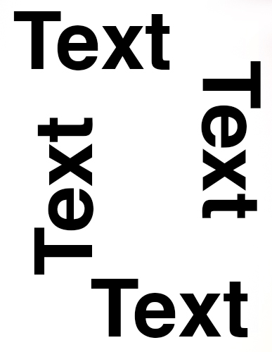
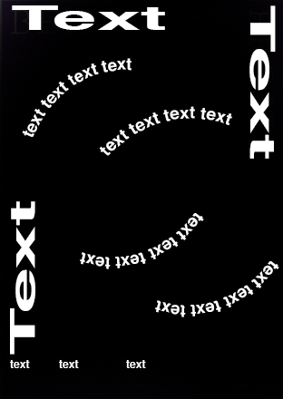
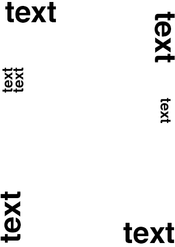
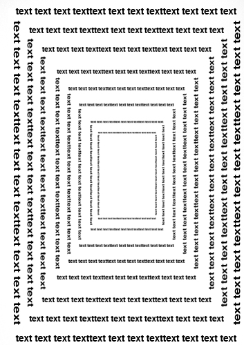
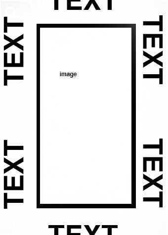
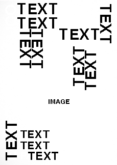
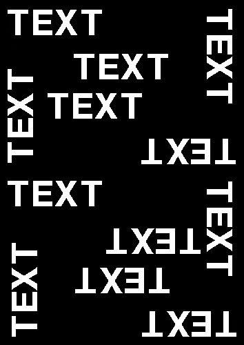
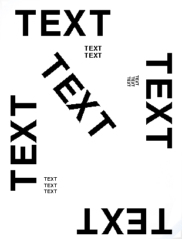
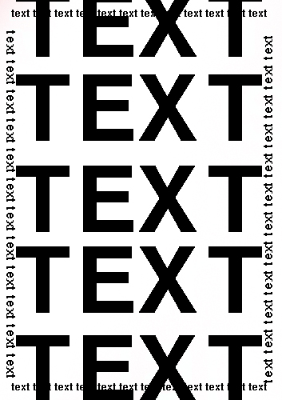

Creator 2
^^^^^^^^^
The Creator 2 got the following instructions:
  Your job is to analyze the training data and then create a poster based on the data. Your main goal is to trick the Evaluator into thinking your creation is authentic. You can copy the elements from the training data, but the Evaluator gets the same data so he can spot direct copies.

  You get the job of deciding the typeface(s). Your job is to only create paragraph styles with the typeface(s) and all modifications related to it.You do NOT decide the content, colors or the typographic position of the text boxes and the size of the typeface.

  Each set you work on 1 file for 30 seconds
  (1 round) at the time.
  You work on file 2 - 1 - 4 - 3 in that order.
  Between rounds there is a break. You should use that to save your file and open the next one. After the 4th round please save the file you are working on also as a pdf in the folder evaluation.

Training Data:

Creator 3
^^^^^^^^^
The Creator 3 got the following instructions:
  Your job is to analyze the training data and then create a poster based on the data. Your main goal is to trick the Evaluator into thinking your creation is authentic. You can copy the elements from the training data, but the Evaluator gets the same data so he can spot direct copies.

  You get the job of create the typographic content(text). Your job is to only create the text.You do NOT decide the image content, colors,typographic position of the text boxes and the size of the typeface or the typefaces.

  Each set you work on 1 file for 30 seconds
  (1 round) at the time.
  You work on file 3 - 4 - 1 - 2 in that order.
  Between rounds there is a break. You should use that to save your file and open the next one. After the 4th round please save the file you are working on also as a pdf in the folder evaluation.

Training Data::

  We love the sky
  BEINTO PROJECT
  social donation project
  2016
  OPEN
  SPACE
  CHANGSEANG
  2016
  Open Space Changseang 2016
  Luciano Lamanna
  LSWHR 11 Dicembre
  Neil Landstrumm
  Stådlin Via Pacinotti 83
  RUMM
  NE
  IL LAN
  DST
  EYES UP EYES UP EYES UP EYES UP
  04.05.2017 04.05.2017 04.05.2017 04.05.2017
  La Baite
  Festival de Geneve
  Batie.ch
  02-17.09.2016
  LORY D
  5 HRS
  LIVE SET
  DONATO
  ANDREA
  LIVE SET
  5 HRS
  LSWHR
  CIRC.
  DOZZY
  DORIA
  28.07
  02 JUNIO
  JARDIN ESD
  17:00H
  EGIPTO PSICODÉLICO
  EGIPTO PSICODELICO
  DJS
  HOUDINI + PANPANNISCUS
  SUMM PARTY
  PARTY
  Juan
  Atkins
  Juan
  Atkins
  Juan
  Atkins
  Lswhr Sabato 20 Febbraio 23:30 - 05:00
  Main Room: Juan Atkins, Ben Saadi, Gattonero Ex Dogana Via dello Scalo S. Lorenzo 10
  Bar Room: LucianoLamanna, FilippoScorcucchi
  Castagne
  19e
  18.04.15
  20h-5h30
  Paris
  parisienne
  POWE
  RJAM
  POWE
  RJAM
  Yoga Underground
  (9) - (12) PM
  48272016
  400 Freedom Blvd
  200 W Provo, UT
  84601
  FAN
  CAS
  SAN
  DRA
  JET
  TEN

Creator 4
^^^^^^^^^
The Creator 4 got the following instructions:
  Your job is to analyze the training data and then create a poster based on the data. Your main goal is to trick the Evaluator into thinking your creation is authentic. You can copy the elements from the training data, but the Evaluator gets the same data so he can spot direct copies.

  You get the job of deciding the colors of the poster and image content if needed.You do NOT decide the text content, typefaces, or the typographic position of the text boxes and the size of the typeface.

  Each set you work on 1 file for 30 seconds
  (1 round) at the time
  You work on file 4 - 3 - 2 - 1 in that order.
  Between rounds there is a break. You should use that to save your file and open the next one. After the 4th round please save the file you are working on also as a pdf in the folder evaluation.

Training Data:

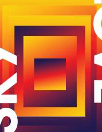

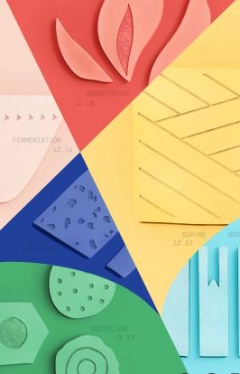

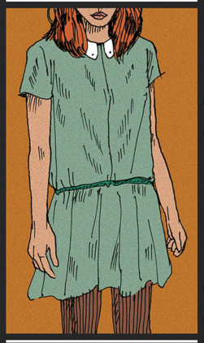
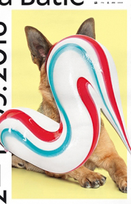
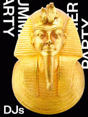
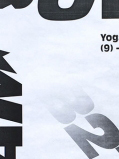
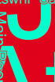
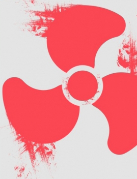
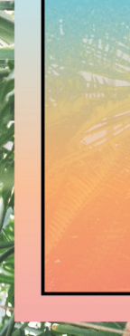

Evaluator
---------
The Evaluator got the following instructions:
  Your job is to analyze the data you are given.
  You will then after each set tag each image(right click on the file) with either of the following three colors:

  **Red:**
  It is obvious that this image was created by the creator nodes and it is not up to standards.

  **Orange:**
  You are not sure if it is created by the network or if it's from the training set

  **Green:**
  This image is up to standards and is in many cases from the training set.

Training Data:

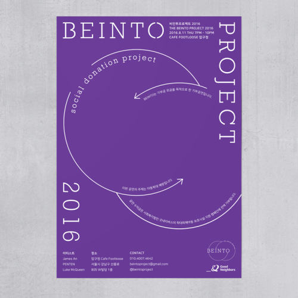
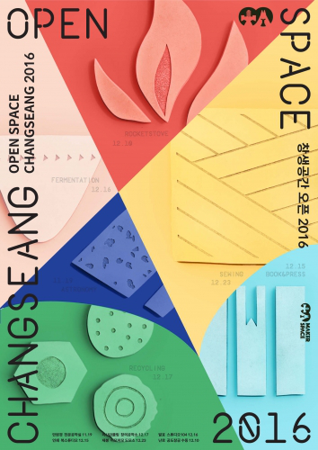
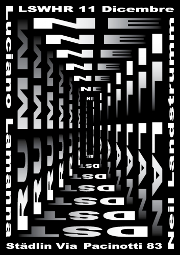
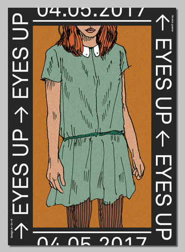
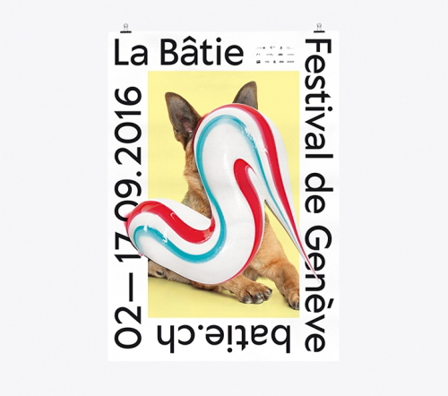
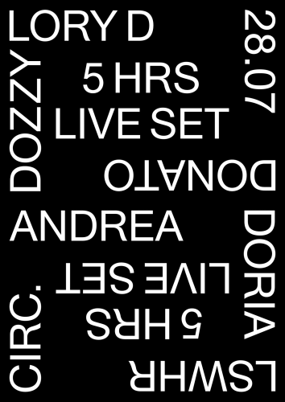
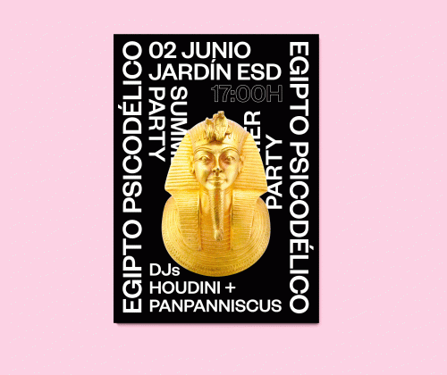
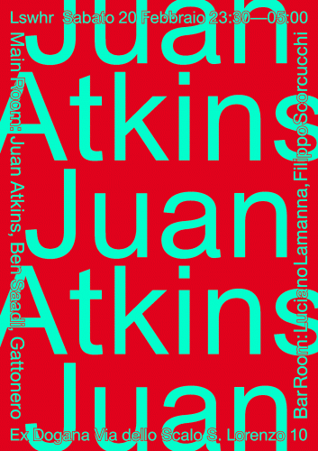
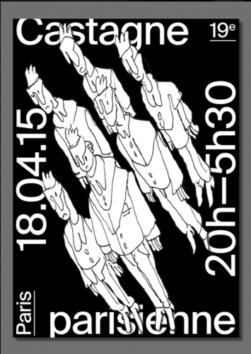
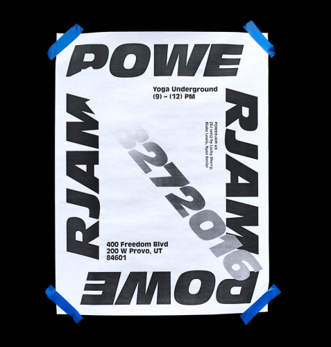
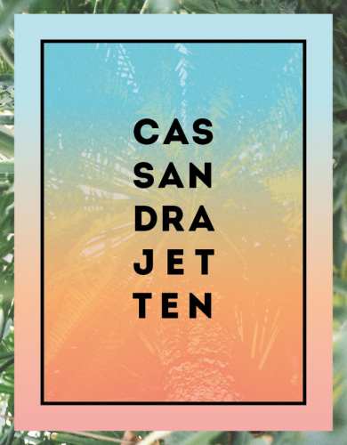

Progress Tracker
----------------
The Progress Tracker got the following instructions:
  Your job is to analyze the results from the Evaluator.
  You will have to log down how well the Evaluator is at guessing correctly if the images are created by the creators or if they come from the dataset. He will label the files with the following colors:

  **Red:**
  It is obvious that this image was created by the creator nodes and it is not up to standards.

  **Orange:**
  You are not sure if it is created by the network or if it’s from the training set

  **Green:**
  This image is up to standards and is in many cases from the training set.

  The results will be x correct guesses out of 8 images. You will also have to track the progress between sets.

Session
*******
.. image:: images/chart.png

The session was made up of 5 sets::

  2 min Reading phase
  2 min Training phase

  2 min Pre-set-preparation
  4 min set 1
    30 sec round 1
    30 sec break
    30 sec round 2
    30 sec break
    30 sec round 3
    30 sec break
    30 sec round 4
    30 sec break
  2 min Data sorting and normalization
  2 min Evaluating
  1 min Progress Tracking
  2 min Reading phase
  2 min Training phase

  2 min Pre-set-preparation
  4 min set 2
    30 sec round 1
    30 sec break
    30 sec round 2
    30 sec break
    30 sec round 3
    30 sec break
    30 sec round 4
    30 sec break
  2 min Data sorting and normalization
  2 min Evaluating
  1 min Progress Tracking

  2 min Pre-set-preparation
  4 min set 3
    30 sec round 1
    30 sec break
    30 sec round 2
    30 sec break
    30 sec round 3
    30 sec break
    30 sec round 4
    30 sec break
  2 min Data sorting and normalization
  2 min Evaluating
  1 min Progress Tracking

  2 min Pre-set-preparation
  4 min set 4
    30 sec round 1
    30 sec break
    30 sec round 2
    30 sec break
    30 sec round 3
    30 sec break
    30 sec round 4
    30 sec break
  2 min Data sorting and normalization
  2 min Evaluating
  1 min Progress Tracking

  2 min Pre-set-preparation
  4 min set 5
    30 sec round 1
    30 sec break
    30 sec round 2
    30 sec break
    30 sec round 3
    30 sec break
    30 sec round 4
    30 sec break
  2 min Data sorting and normalization
  2 min Evaluating
  1 min Progress Tracking

Results
*******
Images
------

Set 1
^^^^^

.. image:: images/poster/set1/1.jpg
   :width: 200 px
.. image:: images/poster/set1/2.jpg
   :width: 200 px
.. image:: images/poster/set1/3.jpg
   :width: 200 px
.. image:: images/poster/set1/4.jpg
   :width: 200 px

Set 2
^^^^^

.. image:: images/poster/set2/1.jpg
   :width: 200 px
.. image:: images/poster/set2/2.jpg
   :width: 200 px
.. image:: images/poster/set2/3.jpg
   :width: 200 px
.. image:: images/poster/set2/4.jpg
   :width: 200 px

Set 3
^^^^^

.. image:: images/poster/set3/1.jpg
   :width: 200 px
.. image:: images/poster/set3/2.jpg
   :width: 200 px
.. image:: images/poster/set3/3.jpg
   :width: 200 px
.. image:: images/poster/set3/4.jpg
   :width: 200 px

Set 4
^^^^^

.. image:: images/poster/set4/1.jpg
   :width: 200 px
.. image:: images/poster/set4/2.jpg
   :width: 200 px
.. image:: images/poster/set4/3.jpg
   :width: 200 px
.. image:: images/poster/set4/4.jpg
   :width: 200 px

Set 5
^^^^^

.. image:: images/poster/set5/1.jpg
   :width: 200 px
.. image:: images/poster/set5/2.jpg
   :width: 200 px
.. image:: images/poster/set5/3.jpg
   :width: 200 px
.. image:: images/poster/set5/4.jpg
   :width: 200 px

Video
-----

.. Gondola drawing
.. ###############
.. Goal
.. ****
.. Nodes
.. *****
.. Creator nodes
.. -------------
.. System
.. ******
.. .. image:: images/chart_gondola.png
..
.. Results
.. *******
.. Images
.. ------
.. Video
.. -----
