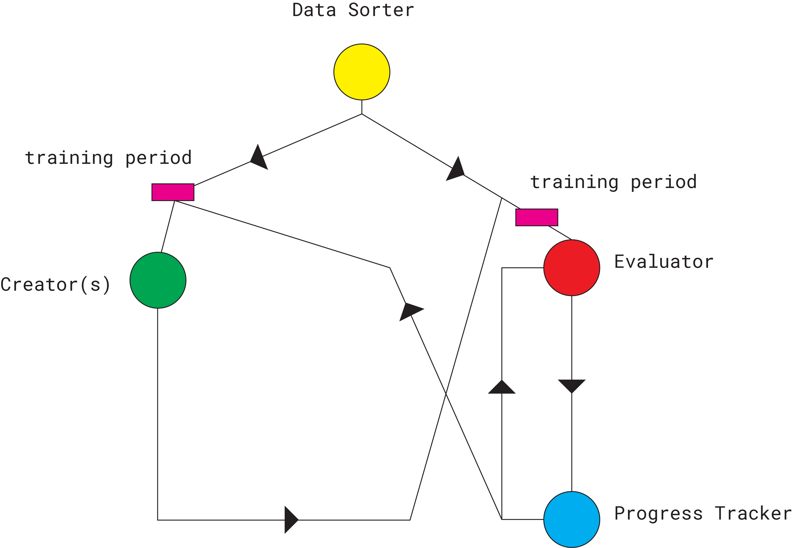

Overview
========
What is it?
***********
Society is on the verge of a lot of change, with the increasing connection we have with technology and the Internet. With the democratization of graphic design, a lot of new "unskilled" people are now suddenly graphic designers. This in terms has turned a lot of design into a mime, "an idea, behavior, or style that spreads from person to person within a culture", with endless similar posters, website, and book designs on websites like Trendlist. A repetitive task that is best suited to machines. But what if, instead of modeling computers after us like Artifical Neural Networks, we model us after computers?

BANN is a design system based on neural networks were humans work together, each on a very specific task, to design whatever they are set up.

How does it work?
*****************

#. The network is gathered and the controller selects what the network will create
#. The data sorter starts gathering data and splitting it into appropriate folders
#. Reading phase starts.
#. Training phase starts.
#. Pre-Set preparation starts.
#. Set 1 starts, with rounds equal to the amount of creator nodes in the network.
#. After the set the Data sorter gathers the output from the creators, adds an equal amount of data from existing source and makes all the files the same size and format. The Data sorter then gives his data to the Evaluator
#. Evaluating
#. Progress Tracking
#. Step 5 - 9 is then repeated as often as desired.
